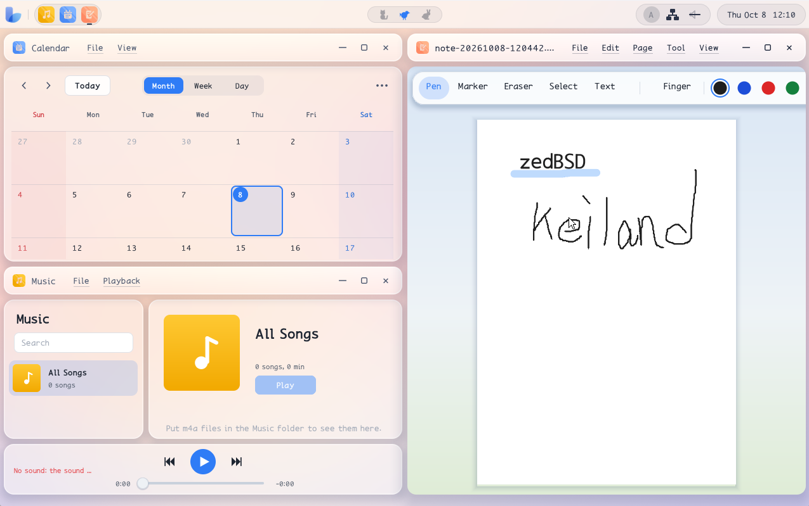
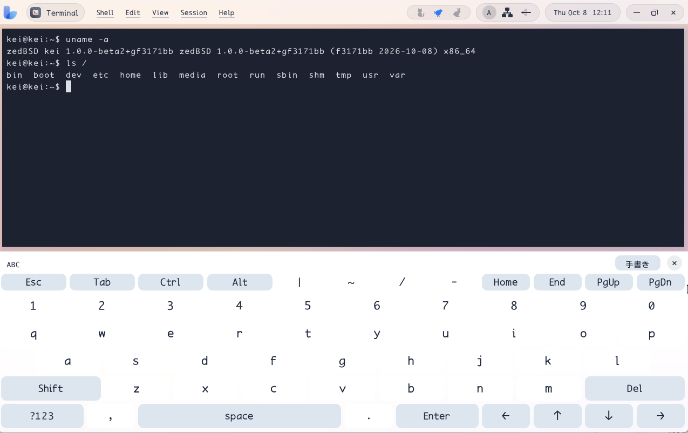
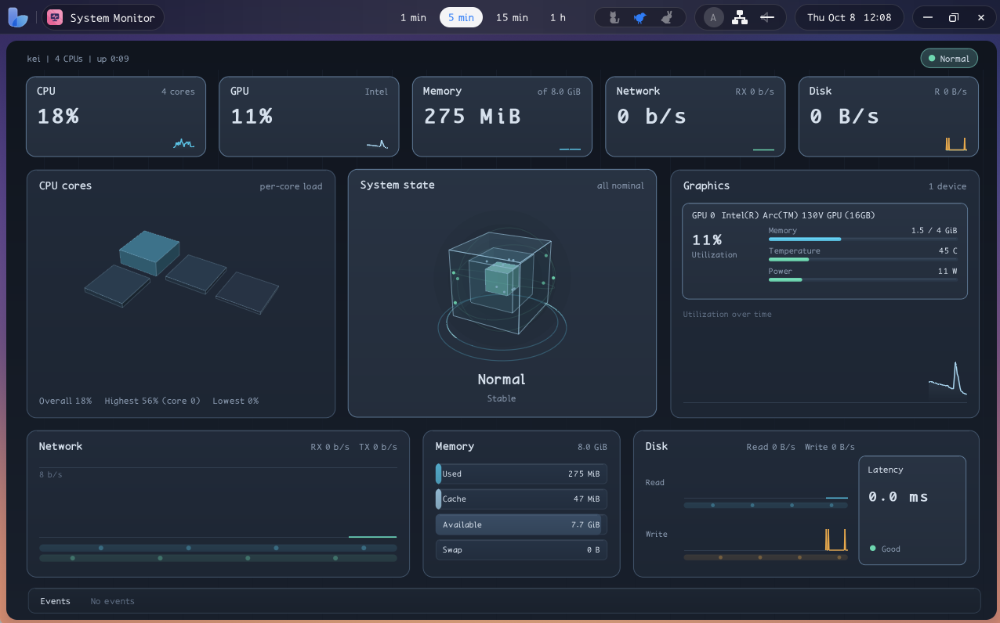

zedBSD and Keiland Desktop
==========================

<div align="center">
  <hr>
  <br>
  <hr>
  <br>
  <hr>
  <br>
  <hr>
</div><br>

`zedBSD` is an operating system for modern computers, including those
with touch displays.  It consists of POSIX-compatible kernel and base
system written from scratch, and ships with `Keiland Desktop`, a
Wayland-based desktop environment that unifies the classic mouse UI/UX
and a futuristic touch UI/UX.

zedBSD aim to become a commercial UNIX in the line of macOS and
Solaris: an operating system made for newly-designed cutting-edge
computers, that changes "the way computing is".  They are written to
conform to `POSIX.1-2024` and to the `Single UNIX Specification,
Version 4` (SUSv4).  It is not yet a certified UNIX system.
Conformance will keep being raised, and UNIX certification from The
Open Group is a goal.  (UNIX is a registered trademark of The Open
Group.)

Getting there means not being bound to an existing kernel or userland
when the whole machine has to move together.  Most of the system is
reimplemented.  Keiland Desktop is a Wayland compositor, and it adds
extensions that existing compositors do not have, so the display,
input, and applications can behave as one machine rather than as a set
of loosely coupled clients.  The same reason applies to the GPU stack
on zedBSD: a native, direct Vulkan path, not Linux DRM/KMS or Mesa.
The desktop is not locked to that kernel.  Keiland Desktop is also
ported to Linux and FreeBSD.

The kernel, drivers, libc, and desktop are developed so that hardware
and software can ship as one product: tablets, phones, and PCs
designed by the same person who directs the OS.  Everything that runs
on open hardware stays free to use.  Features that need the project's
own hardware are still published as source, and only run on that
hardware.

## AI Usage

Both zedBSD and Keiland Desktop are
[designed and directed](plan/master.md)
by one developer and implemented with AI coding agents.  Current targets
are 64-bit x86 PCs and the Raspberry Pi series.

Debugging is done by the latest "Vision Language Model Loop", which
uses a camera to caputure the screen of the PC under debugging.

## Try zedBSD

You do not need to compile from scratch to boot zedBSD. Pre-built
images are published for real PC and QEMU.

### Real PC

Write a disk image to a USB stick, then boot from it.

Supported hardware:
- CPU: Intel 11th-gen+, Tiger Lake or later
- GPU: Intel Iris Xe iGPU (Xe-LP)
- WiFi: Intel AX211 or Realtek RTL8822BU USB

### Windows (VM)

The release archive bundles a custom-patched QEMU build with Windows
Vulkan passthrough.

### Linux (VM)

With QEMU, KVM, and VirGL/Venus available, run:

```sh
qemu-system-x86_64 \
  -machine q35,accel=kvm \
  -cpu host \
  -smp 4 \
  -m 8G \
  -drive if=pflash,format=raw,readonly=on,file=data/edk2-x86_64-code.fd \
  -drive if=pflash,format=raw,file=data/ovmf-vars.fd \
  -device qemu-xhci,id=xhci \
  -drive if=none,id=boot,file=data/hdd-image.img,format=raw \
  -device nvme,serial=kei-boot,drive=boot,bootindex=1 \
  -device virtio-vga-gl,blob=on,hostmem=256M,venus=on \
  -display sdl,gl=on \
  -device usb-multitouch,bus=xhci.0,port=1 \
  -device usb-net,bus=xhci.0,port=2,netdev=net0,msos-desc=on \
  -device usb-kbd,bus=xhci.0,port=3 \
  -device usb-tablet,bus=xhci.0,port=4 \
  -netdev "user,id=net0,hostfwd=tcp:127.0.0.1:2222-:22" \
  -serial stdio
```

### Linux portion of Keiland Desktop

```sh
git clone https://github.com/awemorris/zedBSD.git
cd zedBSD
make keiland-linux
make keiland-linux-install
```

`make keiland-linux` first checks with the package manager (apt, dnf or
yum, pacman) that the packages the build needs are installed. When some are
missing it lists them and, on a terminal, offers to install them with sudo;
otherwise it prints the command and stops. After a good build it offers to
install Keiland at once, which makes `make keiland-linux-install`
unnecessary. `KEILAND_ASK=n` asks nothing and only prints. The package
names are in [userland/desktop/LINUX.md](userland/desktop/LINUX.md).

Then restart your display manager such as GDM.

To run Keiland manually, type:

```sh
/opt/keiland/bin/keiland-desktop
```

### FreeBSD portion of Keiland Desktop

```sh
git clone https://github.com/awemorris/zedBSD.git
cd zedBSD
make keiland-freebsd
make keiland-freebsd-install
```

As on Linux, `make keiland-freebsd` checks the needed packages with `pkg`,
offers to install the missing ones, and offers the install after a good
build ([userland/desktop/README.freebsd.md](userland/desktop/README.freebsd.md)).

To run Keiland manually, type:

```sh
/opt/keiland/bin/keiland-desktop
```

---

## Open hardware and project hardware

Code that runs on generally-sold hardware (PCs, Raspberry Pi series,
and other SBCs) is free for anyone to build and use.  That includes
commercial use, modification, and redistribution under the [zlib
License](LICENSE). Buying project hardware is not required to use that
part of the system, and that split is meant to stay.

Some features can only be realized on hardware designed by this
project. Those features are still published as source, under the same
license. They are not a closed edition. They depend on that hardware,
so they do not run on a generic PC or Raspberry Pi. The sold product
is the computer, not a paid OS license.

zedBSD stay under zlib as the long-term license.  Improvements to the
open-hardware system stay freely usable.

---

## Why a new stack

Two objections come up: why not use the existing open-source
operating-system ecosystem, and whether a Wayland compositor written
here is freeloading on that work.

The first reason is the license of the operating system itself. A
distribution assembled from the usual kernel, libc, desktop, and
applications carries a large set of licenses. Tracking that set is a
core job of a project such as Debian. zedBSD, the base userland, the
libraries, Keiland, and the applications written for this system are
all under the zlib License, so the operating system has one
license. Optional third-party packages under `/usr` can still carry
their own licenses; they are not part of that single-license base.

The second reason is who can change the stack. On Linux, the kernel,
libc, desktop, and applications are developed by separate
organizations. A change that needs all of those layers is slow, and
sometimes impossible, to land as one piece of work. Here those layers
are under one direction. A workload can be tuned by changing the
kernel, the library, the compositor, and the application together.

Keiland implements the Wayland specification and adds extensions that
existing compositors do not have. The specification is the
interface. The compositor, its extensions, and the clients are written
for this system so the display stack can move with the rest of the
OS. That is a reimplementation, not a repackage of an existing
compositor.

The new kernel is not a wall. Keiland has been ported so the desktop
also runs on Linux and FreeBSD. The work is published under zlib for
that use: take it, ship it, and build on it. The point of the
open-hardware system is open innovation, not a requirement that every
user boot zedBSD.

---

## What you get

- **zedBSD** — kernel, HAL, drivers, libc, and base userland.

- **Kei** — the zedBSD-based operating system image.

- **Keiland** Wayland compositor and client applications for
    touch. Extensions beyond existing compositors are added so input,
    display, and applications work as one system. The desktop also
    runs on Linux and FreeBSD.

- **Native Vulkan** — a GPU stack that does not sit on Linux DRM/KMS
    or Mesa, and does not use user-space drivers. Intel iGPU (Xe-LP)
    is supported today. NVIDIA and AMD are planned.

- **Two machine classes** — modern 64-bit x86 and Raspberry Pi, plus
    partial retro targets used to show compatibility.

---

## Status

zedBSD runs on modern computers. Supported development targets:

| Target                      | Role                                          |
|-----------------------------|-----------------------------------------------|
| amd64 (64-bit x86 PC)       | Primary. Default image is GPT + UEFI + NVMe.  |
| Raspberry Pi series         | Primary ARM target.                           |

The zedBSD kernel supports some retro computers.

| Target                      | Role                                          |
|-----------------------------|-----------------------------------------------|
| NEC PC-9800 (i386)          | Partial, compatibility demonstration.         |
| IBM PC/AT (i386)            | Partial, compatibility demonstration.         |
| sun4u (sparcv9)             | Partial, compatibility demonstration.         |
| Sharp X68000 (m68k)         | Partial, compatibility demonstration.         |

---

## Design

zedBSD adopts a layered architecture. Within this design, a component
accesses only components in the layer directly below it and provides
functionality exclusively to the layer directly above it. Furthermore,
dependencies between adjacent layers are kept strictly one-to-one,
preventing tangled cross-layer interactions.

In the case of Linux desktops, the user environment is typically
formed by numerous components with small, focused responsibilities
communicating with one another. This represents a distributed object
design, where the benefit lies in each component having limited scope,
making individual parts relatively easy to develop. On the other hand,
this inevitably creates complex many-to-many relationships among
components. In my personal view, while systems with many-to-many
relationships are straightforward to implement in isolation, they
often struggle with overall system integration—as is often seen in
microkernel-based operating systems.

zedBSD adopts a layered architecture to resolve these trade-offs and
deliver a tightly integrated, cohesive desktop experience directly at
the OS level.

```
+-----------------------------------------------------------------------------------+
| Desktop Apps                                                                      |
+-----------------------------------------------------------------------------------+
| Desktop Server (Wayland-based and X11-compatible, with device control extensions) |
+-----------------------------------------------------------------------------------+
| Desktop HAL Backend (Uses device drivers and base services)                       |
+-----------------------------------------------------------------------------------+
| Base programs (/bin)                                                              |
+-----------------------------------------------------------------------------------+
| Base services (networkd, audiod, mountd, ...)                                     |
+-----------------------------------------------------------------------------------+
| Modern init (/sbin/init)                                                          |
+-----------------------------------------------------------------------------------+
| Drivers (PCI, USB, GPU, disk, ethernet, IP, wifi, filesystem, ...)                |
+-----------------------------------------------------------------------------------+
| Kernel [platform-neutral]                                                         |
+-----------------------------------------------------------------------------------+
| Kernel HAL (CPU + BSP)                                                            |
+-----------------------------------------------------------------------------------+
```

---

## Direct Vulkan GPU Drivers

GPU support is a native, direct Vulkan stack. It does not require
Linux DRM/KMS or Mesa, and it does not use user-space drivers.

Intel Xe-LP is the current driver. NVIDIA and AMD support are planned.

---

## Building

Host prerequisites, configuration, image layout, and the QEMU
procedure are in the build-from-source guide.

On amd64 the default disk image is the native layout: a GPT disk whose
ESP holds the UEFI loader and the kernel, a read-write UFS root
partition, and a swap partition. `make run` starts QEMU with OVMF and
an NVMe disk. Hybrid (UEFI and BIOS), UEFI-only, and BIOS-only layouts
are chosen by setting `ZEDBSD_VARIANT` (`hybrid`, `uefi`, `bios`) in
`config.mk`; `make menuconfig` keeps the value it reads.

```sh
make                   # same as disk-image
make menuconfig        # write config.mk
make disk-image        # build a disk image
make world             # build vmunix and rootfs
make rootfs            # build rootfs
make vmunix            # build the vmunix kernel
make run               # build a disk image and start QEMU
make toolchain-cache   # install the pinned rev-0 LLVM cache (x86_64 Linux)
make toolchain         # build a toolchain
make help              # short command summary
```

---

## Tree

| Directory            | Description                                      |
|----------------------|--------------------------------------------------|
| `include/`           | Public HAL, kernel, and user ABI interfaces      |
| `src/hal/`           | Architecture HALs and board support              |
| `src/kern/`          | Platform-neutral kernel                          |
| `src/drivers/`       | Device and bus drivers                           |
| `src/libc/`          | zedBSD libc                                      |
| `userland/`          | Userland programs                                |
| `userland/base/`     | Base programs and libraries (`/bin`, `/lib`)     |
| `userland/comp/`     | Compilers                                        |
| `userland/desktop/`  | Keiland programs                                 |
| `userland/firmware/` | Optional per-device firmware packages            |
| `userland/packages/` | Third-party packages (`/usr`)                    |
| `platform/`          | Target Makefiles and tools                       |
| `vendor/`            | External programs                                |
| `tools/`             | Development scripts                              |
| `tests/`             | Tests                                            |

---

## License

zedBSD and Keiland Desktop are distributed under the zlib License. See
[LICENSE](LICENSE). The license is not a placeholder for a later
proprietary release. The system is meant to stay published under zlib,
including features that only run on project hardware. What runs on
open hardware PCs, Raspberry Pi, and the other public targets stays
free for anyone to use while conformance work, including a future UNIX
certification, continues.
