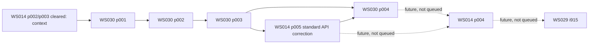

<!-- awesome-plan project=zedbsd record=queue -->

# Queue q308: 標準Vulkan1.0・直接表示libraryと標準APIデモ

<!-- awesome-plan-current:start -->
Status: finished
Active Queue: none
Last Queue: q308
Result: q308-i01 / i02 / i03 / i04 / i05 cleared
Executor: none
<!-- awesome-plan-current:end -->

Authorization: current user、2026-09-13の現行会話。標準APIのvkdemo、公開headerとlibvulkan.so、全Vulkan1.0、direct-display WSIを実装し作業を続行する指示。GitHub同期も明示承認済み。EGLは最新指示でcancel、Waylandは将来backend。
Planning/start UTC: 2026-09-12T16:54:39.282539+00:00
Timebox: 720 active minutes estimate; boundary review every120 active minutes. 各build/VM/pollを有限化し、同じ条件の無変更retryは3回まで。時間枠は無限実行や必ずclearする約束ではなく、未達は証拠と再開条件を残す。

| Order | Attempt | Phase | Status | Scope / prerequisite |
| --- | --- | --- | --- | --- |
| 1 | q308-i01 | [ws030-p001](https://github.com/awemorris/zedBSD/issues/389) | cleared | 標準header・共有library・dispatch。WS014 p002/p003の現行出力を確認 |
| 2 | q308-i02 | [ws030-p002](https://github.com/awemorris/zedBSD/issues/390) | cleared | memory/同期/汎用transport/K支援。p001必要出力の後 |
| 3 | q308-i03 | [ws030-p003](https://github.com/awemorris/zedBSD/issues/391) | cleared | 全core/render/direct-display WSI。p002必要出力の後 |
| 4 | q308-i04 | [ws014-p005](https://github.com/awemorris/zedBSD/issues/387) | cleared | 標準Vulkan APIの回転直方体。WS030 p003の必要library出力の後 |
| 5 | q308-i05 | [ws030-p004](https://github.com/awemorris/zedBSD/issues/392) | cleared | 全API意味論・最終規約・統合受入。p003と訂正p005の証拠の後 |

## 依存とscope

WS030全体とWS014全体を相互の前提にしない。p005が使うのはp003の標準library出力、WS030 p004が使うのはp005の標準API実行証拠というscoped-output依存。各依存出力を現行コードで確認し、Phaseが同じQueueにあるだけで前提成立としない。

詳細scopeと受入は各Phaseおよび [WS030の実装契約](https://github.com/awemorris/zedBSD/issues/388)。全137core関数、対象4表示拡張の適用集合、header ABI/DT_NEEDED/SONAME、宣言するfeatures/limits、CPU/GPU可視性、syncとFIFO/present ownership/image reuseを対象とする。単なるsymbols/stubsや旧有限Venusデモの成功を全API対応と扱わない。

## 実行条件・Upcoming Work Outlook

GuardrailとC規約全文、独立実装、対象make -j16と意味のある限定検証を適用。HALの追加変更は未許可、aggregate make checkは禁止、git add/commit/pushはユーザー所有。awe@10.0.10.25と既存private QEMU環境/image転送の承認を維持し、実機i915やホストsystem設定へ拡張しない。

今回の後はWS014 p004の最終framework/API/規約確認、その後WS029 native i915が候補。どちらもこのQueueに含めない。EGL/GLES-on-Vulkan、Waylandは将来選択待ち。削除済みPriority表は再作成しない。

## 先行履歴

q307 finished / q307-i01当時のclearと実測は `plan/history/queue-q307.md`（local file）および [Queue履歴コメント](https://github.com/awemorris/zedBSD/issues/362#issuecomment-5647081168) に保存。p005の現在clearのみ今回の標準API訂正で失効する。q307履歴を後から失敗や新scopeへ書き換えない。

## q308開始時に具体化したHAL前提（未承認）

現行amd64の静的調査で、hal_space_map()はHAL_SPACE_DEVICEでもRAM aliasを要求してMMIOを拒否し、hal_space_map_device()は16MiB固定PCI windowに限られることが分かった。標準Vulkanのcoherent user mappingと十分なHOST_VISIBLE blob容量に必要な出力は、現行の有限8MiB driver subsetだけでは供給できない。

既存HAL契約内のdevice usermapとkernel可変device windowについて、rootがレビュー可能な具体差分を準備し、ユーザーの適用許可を別途確認する。現時点でHAL source変更はなく、q308の承認をその具体差分の適用許可として扱わない。未承認差分に依存するsource適用・build/runtimeは待つ。独立した公開header/dispatch/library/codec等のU作業は計画同期後に進められる。

coherent memoryをCPU copyで代用してその宣言を維持したり、FIFOやlimitsの未達を無視して全1.0をcompleteとしない。必要HAL出力と承認・適用・検証の実際の状態をp002から後続へ引き渡す。公式rendererの固定参照版はvirglrenderer1.1.0（ローカル調査cache: /tmp/q308-virglrenderer-1.1.0）。EGLはゲスト実装を今回cancelしたまま、既存QEMUホストのegl-headless captureとは区別する。

## 既存MMIO APIの補完案（レビュー待ち）

現在のVenusも `hal_space_map_device()` を利用している。新しいHAL APIを増やす案ではなく、既存APIのamd64実装に可変kernel device windowと明示DEVICE usermapを補う。[未適用の具体差分・静的レビュー・許可後の検証](https://github.com/awemorris/zedBSD/issues/390#issuecomment-5647425525) を提示済み。HAL sourceは未変更、適用許可は未取得。独立U作業を続行する。

## q308 HAL提示差分の承認（2026-09-13・最新）

ユーザーが「この差分の適用と検証を許可する」と回答した。[承認記録](https://github.com/awemorris/zedBSD/issues/390#issuecomment-5647471812) の対象は `plan/ws030/phase002/amd64-device-mapping-proposal.patch`、SHA256 `e6ec9e6c2deda41b840fa6f10846438d091f3a20ce782b9251b7979ac7591c8d`。既存MMIO APIのamd64補完と明示DEVICE usermap・protection/cache検査、hal.hの説明コメントに限り適用と検証を進める。これより前の「HAL未承認・適用待ち」はこの差分について解消した。適用・試験成功はまだ記録していない。別のHAL変更とgit add/commit/pushは許可されたと解釈しない。

## q308 checkpoint001（実装・限定検証の中間結果）

[承認HAL差分の適用・限定試験と実装進捗](https://github.com/awemorris/zedBSD/issues/390#issuecomment-5647774479) を記録。HAL対象・amd64 kernel統合build、HAL/GPU資源寿命/memory共有map/sync/WSIの限定host試験がPASS。全体は未完了で、Phaseのclearanceは変更しない。公開headerは固定Khronos由来1.3.269 headerから1.0 core137＋WSI18をNoctで選択する方式に具体化し、両ABIの配置/定数を照合済み。HAL追加APIなし。256MiB apertureのguest runtime、全entrypoint link/dispatch、残りAPI family、/lib設置と標準vkdemo直接表示の統合受け入れは未検証。以前の「未適用・試験成功なし」はこのcheckpointで述べた範囲について履歴となる。local証拠 `plan/ws030/phase002/checkpoint001.json`。未commitのsourceをGitHub repositoryで読めるとは扱わず、git add/commit/pushはユーザーが行う。

## q308 checkpoint002／第1回時間境界レビュー

[256MiB QEMU受入・PCI cache契約修正・全Vulkan symbol link](https://github.com/awemorris/zedBSD/issues/390#issuecomment-5647977365) を記録。既存Venus経路の49,152画素一致、実PCI/VM回帰試験、memory/descriptor/pipeline/sync/WSIの限定試験がPASS。全137 core＋18 WSIを含むlibvulkan.soと標準vkdemoがlinkし、SONAME/155 exports/依存を検証した。標準アプリのゲスト直接表示、/lib設置、残るAPI peer、最終規約照合は未完了で、各Phaseのclearanceは変更しない。承認HAL差分以外のHAL改変なし、720 active minutes枠内で継続。local証拠 `plan/ws030/phase002/checkpoint002.json`。source/docは未commitのままユーザー担当。

## q308 checkpoint003／標準APIの実ゲスト描画と終了条件

[標準Vulkan6枚描画・通常再起動・155 API検証とconsole復帰の未達](https://github.com/awemorris/zedBSD/issues/392#issuecomment-5648174368) を記録。`q308-standard-vkdemo-002` は /lib/libvulkan.so を使い、実VNC/GPU readback/独立ray-texture oracleを6枚で通過した。SIGINT後の再openも通るが、物理console復帰は `q308-lifecycle-001` で失敗したため修正中。全API peer/dispatch・Noct再生成・能力/破棄失敗レビューは進み、155行の検証台帳を作成した。最終sourceのbuild/実表示・競合・console・規約受入は残っており、clearanceは変更しない。詳細と履歴は `plan/ws030/phase004/checkpoint003.json` と同evidence資料。HALは既承認差分のみ、source/docのgit公開はユーザー担当。

## q308完了: 標準Vulkan・直接表示libraryと標準APIデモ（2026-09-13）

WS030 p001/p002/p003/p004とWS014 p005の標準API訂正をclearedとし、WS030 completed、q308 finished、active Queueなしとする。WS014はincomplete、p001/p004 planning、p004未queue、native i915は別WS029のまま。q307の旧scopeの実測と履歴は保持する。

`libc/include/vulkan/` にVulkan1.0の公開header、`userland/base/libvulkan/` に独立した全137 core＋選択direct-display WSI18の実装を提供し、`/lib/libvulkan.so` に配置した。vkdemoは標準Vulkan/WSIだけを使い、GPU ioctl/Venus codecをアプリへ持ち込まない。ABI、Noct再生成、155実exportとproc-address、全familyの限定意味論試験、U/Kの所有権・権限・失敗回収、適用C規約の独立レビューを実施した。正式CTS認証は主張しない。

最終 `q308-lifecycle-003` は実QEMU10.0.11/virglrenderer1.1.0/Intel ANVで6枚の回転直方体を描画し、実VNC/GPU readback/独立ray-texture oracleが一致（評価対象不一致0）。通常終了後6frame再起動、SIGINT後6frame再起動、640×480文字画面への復帰とechoによる画面更新、別processの表示競合拒否とowner35frame/DONEを確認した。42.671秒、QEMU exit0。最終書式変更後のkernel/appは実行済みbinaryと一致する。

承認済みHAL patch SHA256 `e6ec9e6c2deda41b840fa6f10846438d091f3a20ce782b9251b7979ac7591c8d` のみを適用し、既存hal_space_map_device/device usermapを補完した。追加HAL APIはない。PCI cache属性、queue総数63、allocator破棄、console/query/通知の修正と、先行失敗・再実行理由を保存した。公開coherent HOST_VISIBLE、256MiB aperture、native watchdog等の制約は能力監査へ記録した。

結果は `plan/ws030/results-q308.md`、155行の台帳は `plan/ws030/phase004/api-verification.md`、最終証拠は `plan/ws030/phase004/final-evidence/verification.json`、p005訂正は `plan/ws014/phase005/results-q308.md`、履歴は `plan/history/queue-q308.md`（いずれもlocal/uncommitted）。GitHubは計画Issue/Project/結果コメントの同期であり、source/doc/imageのgit add/commit/pushはユーザーが行う。EGLは今回cancel、Waylandは将来VK_KHR_wayland_surface backendとして追加する。
