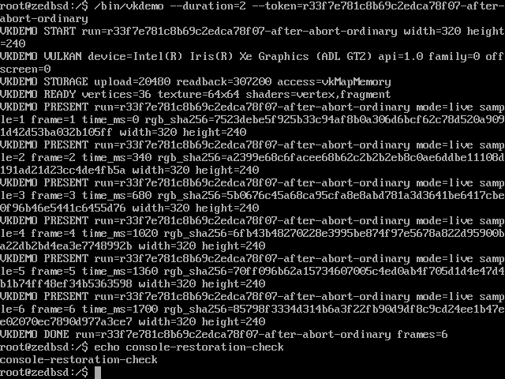

# q308: 標準Vulkan1.0・direct-display受け入れ結果

2026-09-13 JST。WS030 p001/p002/p003/p004と、WS014 p005の標準APIへの訂正を受け入れる。最終実ゲスト試行は `q308-lifecycle-003`。Vulkan1.0 core137＋選択WSI18の実装・限定意味論試験・適用規約レビューと、実画面での回転・終了・所有権・文字画面復帰を確認した。これはKhronos CTS合格・正式認証の宣言ではない。

## 成果

- 公開header: `libc/include/vulkan/`。固定したKhronos由来宣言をNoctで選択・再生成し、i386/amd64の122構造体、842 field配置、2348定数を独立参照と照合した。
- 独立実装: `userland/base/libvulkan/`、配置 `/lib/libvulkan.so`。全155公開symbol、SONAME、libc依存、アプリのDT_NEEDED/interpreterを検証した。内部helperは公開しない。
- `userland/base/vkdemo/` は標準APIだけを使う。元頂点・textureをCPUで用意し、独自vertex/fragment shader、depth、descriptor/pipelineを使ってGPUが回転直方体を描く。CPU完成画像による代用やアプリのGPU ioctl/Venus依存はない。別OSのVulkan実装を使うoffscreen build/実行も確認済み。
- Uは標準Vulkanのhandle/allocator/codec/command/sync/WSIを所有する。Kは既存の通常GPU登録を保ち、動的resource、共有map、参照寿命、入力・権限、display lease/所有権を補う。
- direct-displayは `VK_KHR_surface` / `VK_KHR_display` / `VK_KHR_swapchain` / `VK_KHR_display_swapchain` のVulkan1.0適用18 command。GPU完了、表示用private front/back、FIFO進行、image再利用を分離し、失敗時の部分回収を検証する。

## 最終実画面

private host `awe@10.0.10.25` のQEMU10.0.11、virglrenderer1.1.0、Intel i915/ANVで実行。zedBSDは2CPU・1GiB RAM、Venus host-visible aperture256MiB。専用設定は既存PC/AT文字表示backendを有効にする。

| frame | mode | time_ms | 独立oracle評価画素 | 不一致 |
|---|---|---|---|---|
| 1 | fixed | 0 | 75841 | 0 |
| 2 | fixed | 1000 | 76045 | 0 |
| 3 | fixed | 2500 | 76089 | 0 |
| 4 | live | 0 | 75841 | 0 |
| 5 | live | 790 | 75952 | 0 |
| 6 | live | 1620 | 76221 | 0 |

6枚すべてで実VNC RGB hashとGPU readbackが一致した。oracleは独立したray/texture期待値で、境界の有限除外範囲を記録する。同じVMで通常再起動が 6 frame、SIGINTによる異常終了後の再起動が 6 frame 進み、双方DONEとシェル復帰を確認した。

終了後の実画面は640×480の文字画面へ戻った。`echo console-restoration-check` 前後の実VNC画像が変わり、取得画像でも文字とpromptを確認した。consoleのretained cellsをRAMへsnapshotし、workerがnative lease/legacy所有中は退避、解放後に表示する。GPUのresetで他Vk objectを失わせない。kernel logも共通文字出力経由で再描画通知を出す。

独立したbackground所有者が描画中、別processのswapchain作成は `VK_ERROR_NATIVE_WINDOW_IN_USE_KHR` で拒否され、所有者は 35 frame を描いて正常終了した。実行全体 42.671 秒、QEMU終了0。

## 意味論・ABI・規約の確認

[155 API台帳](phase004/api-verification.md) は公開宣言/dispatch/実装/意味論試験を対応させる。実装18familyを結合したDSOの155symbolとglobal/instance/device・拡張・複数GPU規則を通常・ASan/UBSanで確認した。Noctの公開ABI/codec/commands/resources/dispatch再生成はbyte-identical。

実objects/wire/codecを用いたfamily別peerが、複数GPU・allocator callback、memory7、descriptor8、pipeline9、resource24、command52、sync/queue/query19、WSI18を検証する。count/truncation、ignored pointer、primary/secondary、破損返信、partial creation、失敗回収、device lost、同期待ちと表示進行を含む。4096object/4thread、97command buffer、40descriptor sets、37pipeline/images、80KiB streamなどで旧固定subsetを超える経路を確認した。

KのGPU/VM/PCI/HAL対象は、実関数と境界mockを区別した限定fixtureを使う。権限・所有権・6 display操作、map/fork/split/NONE→RW・pinとfd close、callback-before-close、PCI cache-only属性と4GiB超BAR、exact HAL patchを確認した。文字snapshotはlive framebuffer/VRAMをアクセス禁止にして実関数を実行し、MMIO readなしで全画素・cursor・状態復元を検証した。console workerのnative/legacy排他、query、thread失敗、有限stop/reapと不確定DMAの保持も通常・ASan/UBSanで確認した。

C規約全文に沿う定義・宣言、処理段落、error/ownership、U/K境界を担当者とは別にレビューし、能力公開のqueue合計63、破棄時allocator userdata、blob/descriptor複合失敗、console query/通知の不足を修正した。最後の2箇所の `for (;;)` → `while (1)` だけが実行snapshotとの差分で、逆変換のSHA一致と最終buildのkernel/app byte一致で対応を確認した。追加の無変更VM再試行はしていない。

[能力監査](phase004/capabilities.md) に55featureの転送経路とlimit/memory/queue方針を記す。公開HOST_VISIBLEは実共有mmapを持つHOST_COHERENT typeだけ。native memory type indexは保ち、不適合GPUだけを除外する。host heap sizeは空き容量ではなく、256MiB apertureやallocation失敗は有限資源の制約である。native返信watchdogによる長時間compile等のdevice-lostの可能性を記す。全optional feature組合せ・全limit境界の実機実測を主張しない。

## 適用HAL・成果物の対応

許可されたpatchは `phase002/amd64-device-mapping-proposal.patch`、SHA256 `e6ec9e6c2deda41b840fa6f10846438d091f3a20ce782b9251b7979ac7591c8d`。既存 `hal_space_map_device()` の可変map、DEVICE usermap/protection/cache維持を補完し、新HAL関数は追加しない。以後のconsole/PCI修正をHALへ混ぜていない。

| 成果物 | 最終SHA256 |
|---|---|
| vmunix | `8aef745f50ee0da90775f8f6885348f6bcccc040f1665ff85a83873f09258c17` |
| /lib/libvulkan.so | `fb4b5eb18c29d4d6a45dda9ea9ed077992eccb46de4dd5a9bc6f2d77dbe23411` |
| /bin/vkdemo | `66d288f64f63c0a1b5d551c42891d83f4ff02e9e41da0e68a629dd70d6cd5547` |

[最終証拠](phase004/final-evidence/verification.json) に全source対応、実行結果、ログと画像のhashを保存した。完全な独立再現手順は各試験runnerと `plan/ws014/tests/run-vkdemo-remote.py --lifecycle`。通常の作業設定・他VM・ホストsystem packageは変更しない。

## 保存した失敗履歴

- `q308-aperture256-001`: cache専用引数へREAD/WRITEを混ぜたPCI呼出しを修正。002で256MiB apertureと既存2D/Venus経路を確認した。
- `q308-standard-vkdemo-001`: 1570msで正当に1面だけ見える画像をoracleが拒否。画素不一致0という観測を保ち、oracleの条件を修正し13試験を通過。002は同じimageで標準描画を通過した。
- `q308-lifecycle-001`: 異常終了/再openは通ったが、文字画面復帰が未実装だった。
- `q308-lifecycle-002`: snapshot providerを専用設定で無効にしていたため復帰せず、さらに競合エラーの診断名をharnessが取り違えた。実ログでは競合拒否と所有者35frame/DONEを確認した。設定とharnessを修正し003で全項目を通過。失敗resultは上書きしない。

## 引き渡し

WS030の単一目標を受け入れ、WS030を再利用しない。q308は選択した5件だけで完了する。WS014 p005の標準API訂正をclearするが、q307の旧scopeの履歴を改変しない。WS014はincomplete、p001/p004はplanning、p004は新しいQueue未選択のまま。native i915は別WS029。EGLは今回cancel、Waylandは将来 `VK_KHR_wayland_surface` backendを追加する。

GitHubは計画Issue/Projectと結果コメントを同期する。source・資料・画像のgit add/commit/pushはユーザー所有であり、未commitファイルがrepositoryの公開branchに存在するとは記録しない。
